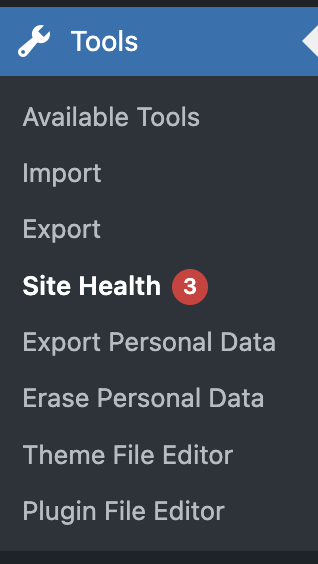
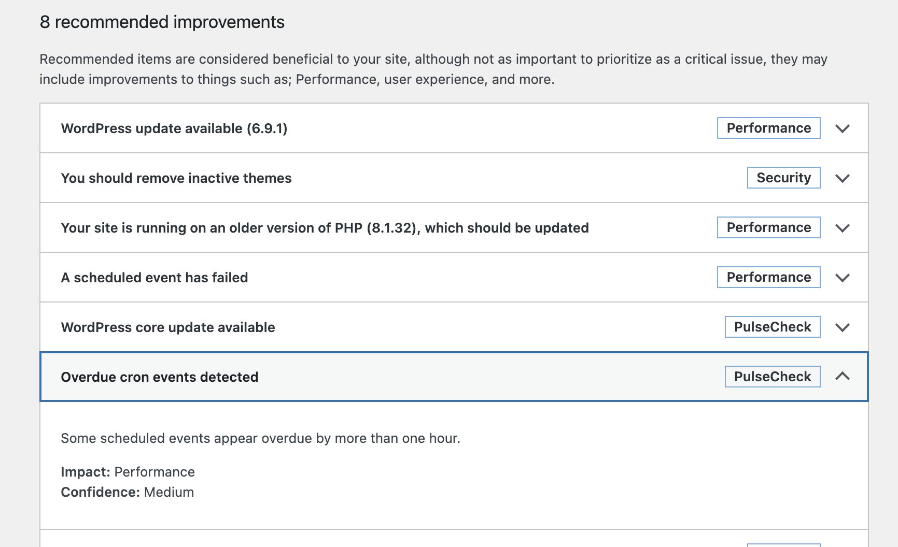
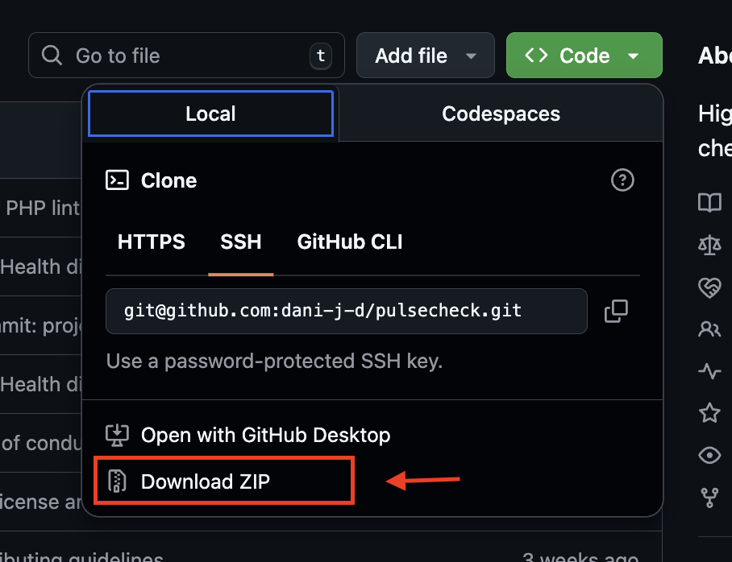
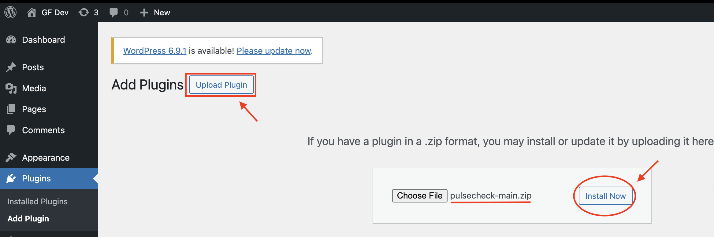
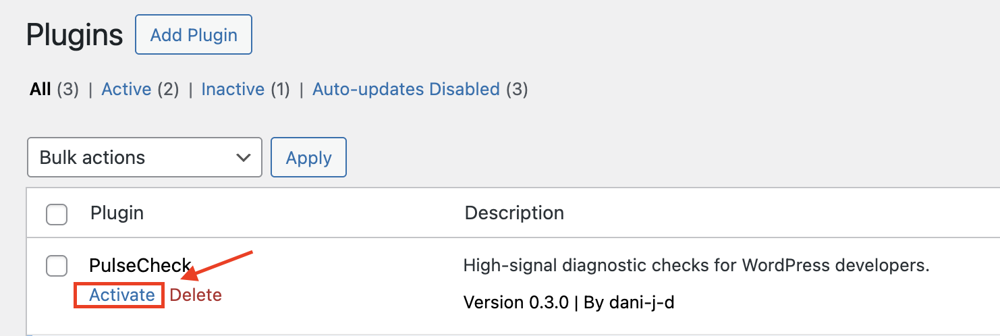

# PulseCheck

PulseCheck is a lightweight WordPress plugin that provides high-signal diagnostic
checks for developers and agencies maintaining WordPress sites.

## What PulseCheck Does

- Adds custom checks to the WordPress Site Health screen

  

- Evaluates environment and configuration risks
- Provides clear, developer-readable explanations
- Makes no changes to the site

  

## What PulseCheck Does Not Do

- Automatically fix issues
- Scan for vulnerabilities or CVEs
- Replace security or performance plugins
- Provide guarantees about exploitability

## Current Checks (v0.3)

* PHP version compatibility and risk assessment
* WordPress core version currency and update recommendation
* Cron Health / Missed Schedules detection

## How to use PulseCheck

### Installation 

For users, the easiest installation option is to upload a ZIP file via WP Admin.
1. Download the repository as a ZIP file

    

2. In your WordPress admin dashboard, go to: Plugins → Add New → Upload Plugin

4. Upload the ZIP file

5. Click Install Now

    

6. Activate PulseCheck

    

## Philosophy

PulseCheck is intentionally limited.

The intent is to add useful information for preventative maintenance, site stability, and navigating security risks.

This plugin prioritizes:
- Signal over coverage
- Diagnostics over remediation
- Explanation over enforcement

### Design Principles

- Extends native WordPress Site Health instead of replacing it
- Uses WordPress hooks and filters, not direct database manipulation
- Read-only diagnostics (no mutation of site state)
- Small, composable check classes
- Designed for incremental extension

## License

GPL-2.0-or-latest
